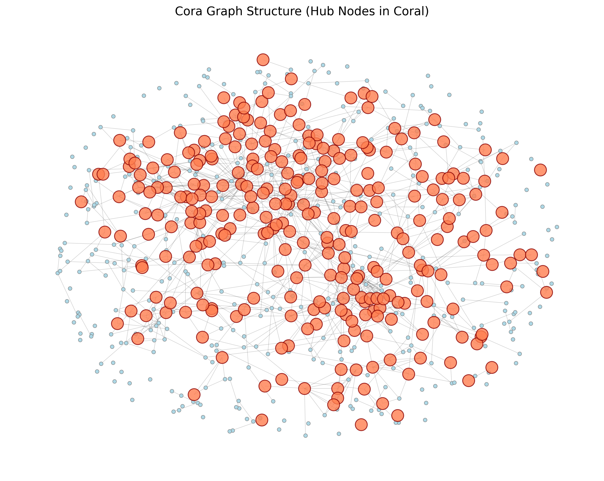
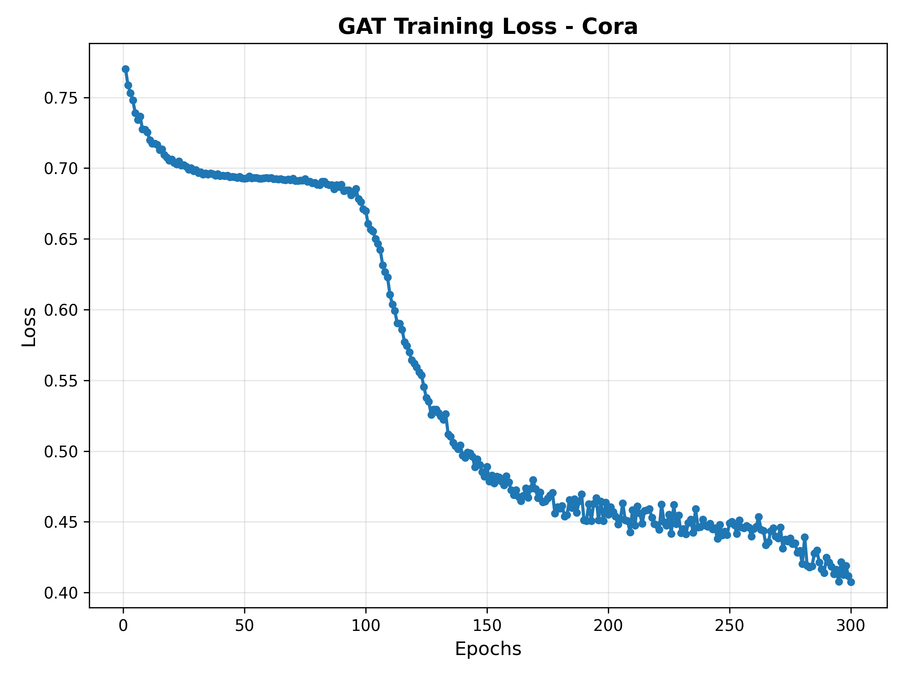
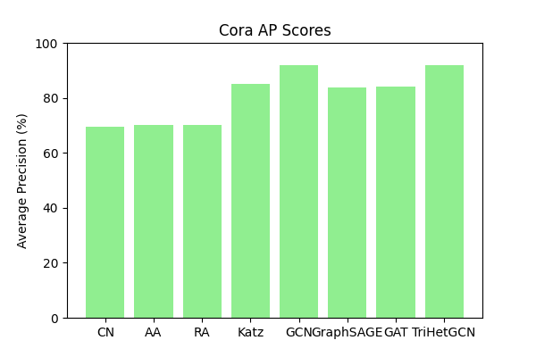

---

```markdown
# 📊 Streamlit Data Analysis App

This is a modular and interactive Streamlit web application for graph-based data analysis and link prediction. It supports real-time data visualization, model evaluation, and graph plotting—specifically built for datasets like Cora.

---

## 🚀 Features

- 📈 Visualize graph structures and training progress
- 🤖 Includes traditional and deep learning-based link prediction
- 🧮 Evaluation metrics (AUC, AP) for multiple models
- 📊 Comparative performance charts
- 🔌 Easily extendable for new datasets or graph models

---

## 📁 Project Structure

```

Final\_Draft/
├── app.py                # Main Streamlit app
├── modules/              # Core Python modules
├── output/               # Generated plots and reports
├── requirements.txt      # Python dependencies
├── render.yaml           # Render deployment configuration
├── README.md             # Project overview
└── LICENSE               # License file (MIT)

````

---

## 🧪 Running the App Locally

### 1. Clone the Repository

```bash
git clone https://github.com/yourusername/final-draft.git
cd final-draft
````

### 2. (Optional) Create a Virtual Environment

```bash
python -m venv venv
source venv/bin/activate  # Windows: venv\Scripts\activate
```

### 3. Install Dependencies

```bash
pip install -r requirements.txt
```

### 4. Start the Streamlit App

```bash
streamlit run app.py
```

---

## 🌐 Deploying on Render.com

Make sure your repository contains:

* `requirements.txt`
* `render.yaml`

Start command for deployment:

```bash
streamlit run app.py --server.port $PORT --server.enableCORS false
```

Then visit [https://render.com](https://trihetgcn.onrender.com), connect your repo, and deploy.

---

## 📸 Screenshots

### 🔹 Cora Graph Structure

<p align="center">  </p>

### 🔹 GAT Training Loss (Cora)
<p align="center"></p>

### 🔹 Cora AUC Scores (Various Models)

<p align="center">
  
</p>

### 🔹 Cora AP Scores (Various Models)

<p align="center">
  
</p>

---

## 👤 Author

**Vikram Kumar**
[GitHub](https://github.com/Viki2223) | [LinkedIn](https://www.linkedin.com/in/vikram-kumar-69a4a42a1/)

---

---

## 🤝 Contributing

Pull requests are welcome. For major updates, open an issue first to discuss what you'd like to change.

---

```

---

### 📁 How to Organize Your GitHub Repository

```

final-draft/
├── app.py
├── modules/
├── output/
├── assets/
│   ├── cora\_graph\_structure.png
│   ├── gat\_training\_loss.png
│   ├── cora\_auc\_scores.png
│   └── cora\_ap\_scores.png
├── requirements.txt
├── render.yaml
├── LICENSE
└── README.md

```

```
